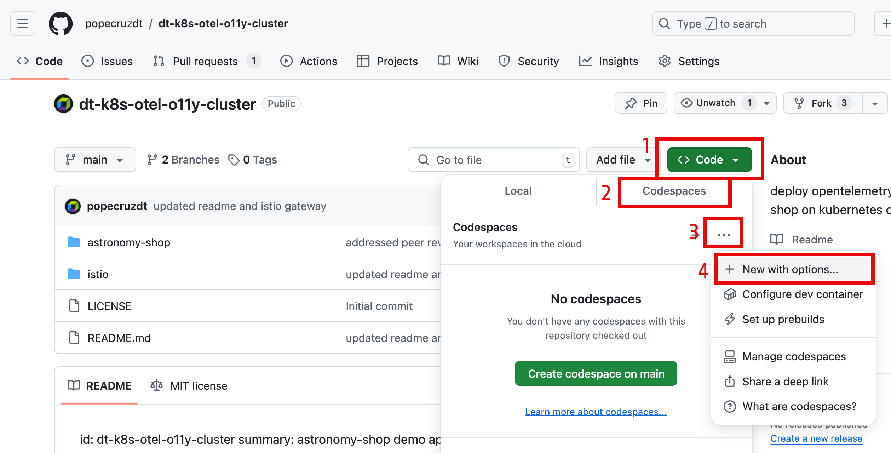
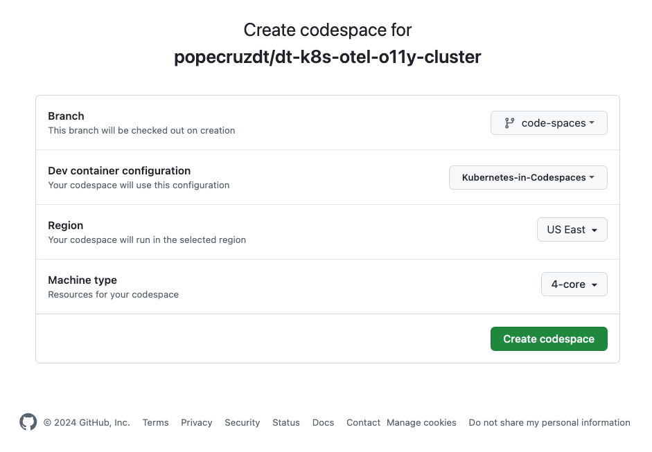
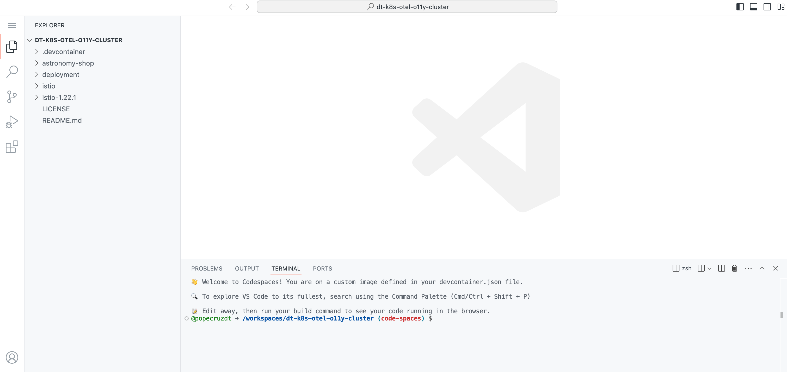
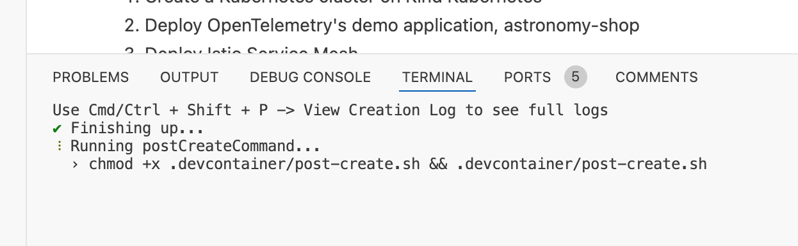
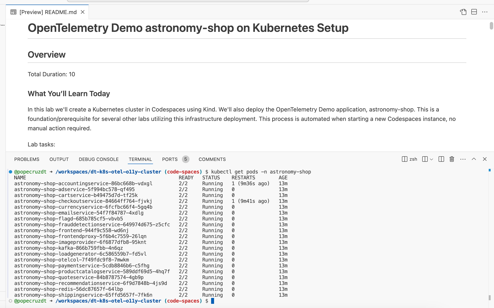

## Codespaces Cluster Set Up

Create a new instance or use an existing instance of the `dt-k8s-otel-o11y-cluster` Codespaces.

[dt-k8s-otel-o11y-cluster](https://github.com/popecruzdt/dt-k8s-otel-o11y-cluster/tree/code-spaces)

Navigate to the Github repository.  Click on `Code`.  Click on `Codespaces`.  Click on `New with options`.



Choose the Branch `code-spaces`.  Choose the Dev Container Configuration `Kubernetes in Codespaces`.

Choose a Region near your Dynatrace tenant.

Choose Machine Type `4-core`.



Allow the Codespace instance to fully initialize.  It is not ready yet.



The Codespace instance will run the post initialization scripts.



When the Codespace instance is idle, validate the `astronomy-shop` pods are running.

Command:
```sh
kubectl get pods -n astronomy-shop
```

