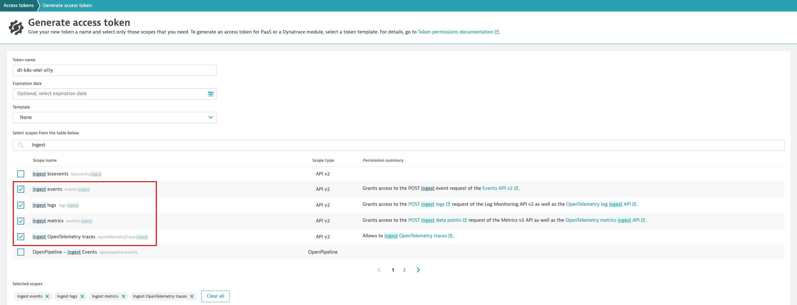

## Generate Dynatrace Access Token

Generate a new API access token with the following scopes:
```
Ingest events
Ingest logs
Ingest metrics
Ingest OpenTelemetry traces
```
[See Related Dynatrace API Token Creation Documentation](https://docs.dynatrace.com/docs/dynatrace-api/basics/dynatrace-api-authentication#create-token)

