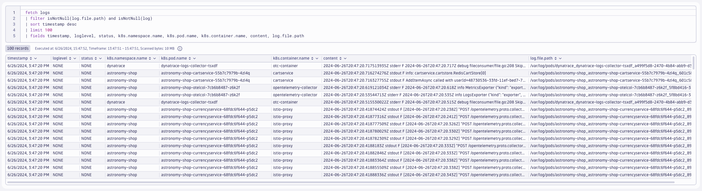
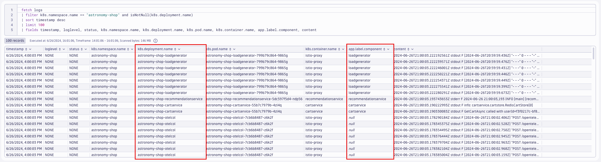
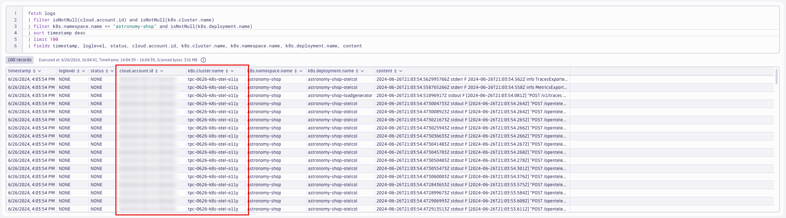
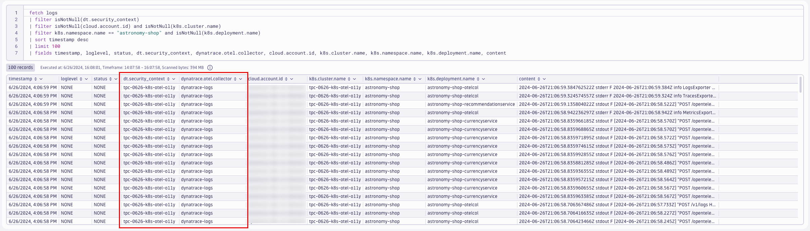
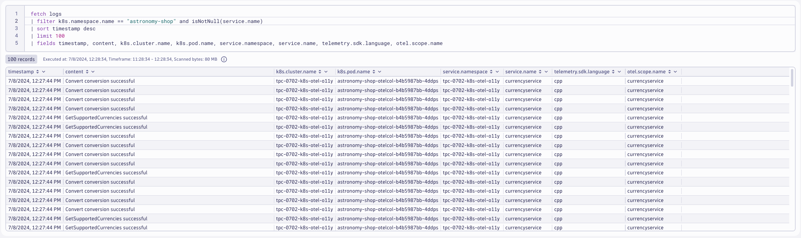

## OpenTelemetry Collector for Logs
https://docs.dynatrace.com/docs/extend-dynatrace/opentelemetry/collector/deployment

### Deploy OpenTelemetry Collector

### Dynatrace Distro - Daemonset (Node Agent)
https://docs.dynatrace.com/docs/extend-dynatrace/opentelemetry/collector/deployment#tabgroup--dynatrace-docs--agent

Pod (and container) logs are written to the filesystem of the Node where the pod is running.  Therefore the Collector must be deployed as a Daemonset to read the log files on the local Node.

```yaml
---
apiVersion: opentelemetry.io/v1alpha1
kind: OpenTelemetryCollector
metadata:
  name: dynatrace-logs
  namespace: dynatrace
spec:
  envFrom:
  - secretRef:
      name: dynatrace-otelcol-dt-api-credentials
  mode: "daemonset"
  image: "ghcr.io/dynatrace/dynatrace-otel-collector/dynatrace-otel-collector:latest"
```
Command:
```sh
kubectl apply -f opentelemetry/collector/logs/otel-collector-logs-crd-01.yaml
```
Sample output:
> opentelemetrycollector.opentelemetry.io/dynatrace-logs created

### Validate running pod(s)
Command:
```sh
kubectl get pods -n dynatrace
```
Sample output:
| NAME                             | READY | STATUS  | RESTARTS | AGE |
|----------------------------------|-------|---------|----------|-----|
| dynatrace-logs-collector-8q8tz   | 1/1   | Running | 0        | 1m  |

### `filelog` receiver
https://opentelemetry.io/docs/kubernetes/collector/components/#filelog-receiver
```yaml
config: |
    receivers:
      filelog:
        ...
    service:
      pipelines:
        logs:
          receivers: [filelog]
          processors: [batch]
          exporters: [otlphttp/dynatrace]
```

### Query logs in Dynatrace
DQL:
```sql
fetch logs
| filter isNotNull(log.file.path) and isNotNull(log)
| sort timestamp desc
| limit 100
| fields timestamp, loglevel, status, k8s.namespace.name, k8s.pod.name, k8s.container.name, content, log.file.path
```
Result:



## k8sattributes Processor

### Create `clusterrole` with read access to Kubernetes objects
```yaml
---
apiVersion: rbac.authorization.k8s.io/v1
kind: ClusterRole
metadata:
  name: otel-collector-k8s-clusterrole-logs
rules:
- apiGroups: [""]
  resources: ["pods", "namespaces", "nodes"]
  verbs: ["get", "watch", "list"]
- apiGroups: ["apps"]
  resources: ["replicasets"]
  verbs: ["get", "list", "watch"]
- apiGroups: ["extensions"]
  resources: ["replicasets"]
  verbs: ["get", "list", "watch"]
```
Command:
```sh
kubectl apply -f opentelemetry/rbac/otel-collector-k8s-clusterrole-logs.yaml
```
Sample output:
> clusterrole.rbac.authorization.k8s.io/otel-collector-k8s-clusterrole-logs created

### Create `clusterrolebinding` for OpenTelemetry Collector service account
```yaml
---
apiVersion: rbac.authorization.k8s.io/v1
kind: ClusterRoleBinding
metadata:
  name: otel-collector-k8s-clusterrole-logs-crb
subjects:
- kind: ServiceAccount
  name: dynatrace-logs-collector
  namespace: dynatrace
roleRef:
  kind: ClusterRole
  name: otel-collector-k8s-clusterrole-logs
  apiGroup: rbac.authorization.k8s.io
```
Command:
```sh
kubectl apply -f opentelemetry/rbac/otel-collector-k8s-clusterrole-logs-crb.yaml
```
Sample output:
> clusterrolebinding.rbac.authorization.k8s.io/otel-collector-k8s-clusterrole-logs-crb created

### Add `k8sattributes` processor
https://opentelemetry.io/docs/kubernetes/collector/components/#kubernetes-attributes-processor

The `k8sattributes` processor will query metadata from the cluster about the k8s objects.  The Collector will then marry this metadata to the telemetry.

```yaml
k8sattributes:
    auth_type: "serviceAccount"
    passthrough: false
        filter:
        node_from_env_var: KUBE_NODE_NAME
    extract:
        metadata:
            - k8s.namespace.name
            - k8s.deployment.name
            - k8s.daemonset.name
            - k8s.job.name
            - k8s.cronjob.name
            - k8s.replicaset.name
            - k8s.statefulset.name
            - k8s.pod.name
            - k8s.pod.uid
            - k8s.node.name
            - k8s.container.name
            - container.id
            - container.image.name
            - container.image.tag
        labels:
        - tag_name: app.label.component
            key: app.kubernetes.io/component
            from: pod
    pod_association:
        - sources:
            - from: resource_attribute
              name: k8s.pod.uid
        - sources:
            - from: resource_attribute
              name: k8s.pod.name
        - sources:
            - from: resource_attribute
              name: k8s.pod.ip
        - sources:
            - from: connection
```
Command:
```sh
kubectl apply -f opentelemetry/collector/logs/otel-collector-logs-crd-02.yaml
```
Sample output:
> opentelemetrycollector.opentelemetry.io/dynatrace-logs configured

### Validate running pod(s)
Command:
```sh
kubectl get pods -n dynatrace
```
Sample output:
| NAME                             | READY | STATUS  | RESTARTS | AGE |
|----------------------------------|-------|---------|----------|-----|
| dynatrace-logs-collector-dns4x   | 1/1   | Running | 0        | 1m  |

### Query logs in Dynatrace
DQL:
```sql
fetch logs
| filter k8s.namespace.name == "astronomy-shop" and isNotNull(k8s.deployment.name)
| sort timestamp desc
| limit 100
| fields timestamp, loglevel, status, k8s.namespace.name, k8s.deployment.name, k8s.pod.name, k8s.container.name, app.label.component, content
```
Result:



## resourcedetection Processor

### Add `resourcedetection` processor
https://github.com/open-telemetry/opentelemetry-collector-contrib/blob/main/processor/resourcedetectionprocessor/README.md#gcp-metadata
```yaml
processors:
  resourcedetection/gcp:
    detectors: [env, gcp]
    timeout: 2s
    override: false
```

**note:** for this lab, the Kind cluster does not have cloud metadata to collect.  These values will be spoofed for the purposes of this lab.
```yaml
resource/kind:
  attributes:
  - key: cloud.account.id
    value: dt-k8s-o11y-account
    action: insert
  - key: k8s.cluster.name
    value: dt-k8s-o11y-kind
    action: insert
```

Command:
```sh
kubectl apply -f opentelemetry/collector/logs/otel-collector-logs-crd-03.yaml
```
Sample output:
> opentelemetrycollector.opentelemetry.io/dynatrace-logs configured

### Validate running pod(s)
Command:
```sh
kubectl get pods -n dynatrace
```
Sample output:
| NAME                             | READY | STATUS  | RESTARTS | AGE |
|----------------------------------|-------|---------|----------|-----|
| dynatrace-logs-collector-fbtk5   | 1/1   | Running | 0        | 1m  |

### Query logs in Dynatrace
DQL:
```sql
fetch logs
| filter isNotNull(cloud.account.id) and isNotNull(k8s.cluster.name)
| filter k8s.namespace.name == "astronomy-shop" and isNotNull(k8s.deployment.name)
| sort timestamp desc
| limit 100
| fields timestamp, loglevel, status, cloud.account.id, k8s.cluster.name, k8s.namespace.name, k8s.deployment.name, content
```
Result:



## resource Processor

### Add `resource` processor (attributes)
https://github.com/open-telemetry/opentelemetry-collector-contrib/tree/main/processor/resourceprocessor

The `resource` processor allows us to directly add, remove, or change resource attributes on the telemetry.
```yaml
processors:
    resource:
        attributes:
        - key: k8s.pod.ip
          action: delete
        - key: telemetry.sdk.name
          value: opentelemetry
          action: insert
        - key: dynatrace.otel.collector
          value: dynatrace-logs
          action: insert
        - key: dt.security_context
          from_attribute: k8s.cluster.name
          action: insert
```
Command:
```sh
kubectl apply -f opentelemetry/collector/logs/otel-collector-logs-crd-04.yaml
```
Sample output:
> opentelemetrycollector.opentelemetry.io/dynatrace-logs configured

### Validate running pod(s)
Command:
```sh
kubectl get pods -n dynatrace
```
Sample output:
| NAME                             | READY | STATUS  | RESTARTS | AGE |
|----------------------------------|-------|---------|----------|-----|
| dynatrace-logs-collector-xx6km   | 1/1   | Running | 0        | 1m  |

### Query logs in Dynatrace
DQL:
```sql
fetch logs
| filter isNotNull(dt.security_context)
| filter isNotNull(cloud.account.id) and isNotNull(k8s.cluster.name)
| filter k8s.namespace.name == "astronomy-shop" and isNotNull(k8s.deployment.name)
| sort timestamp desc
| limit 100
| fields timestamp, loglevel, status, dt.security_context, dynatrace.otel.collector, cloud.account.id, k8s.cluster.name, k8s.namespace.name, k8s.deployment.name, content
```
Result:



## Export to OTLP Receiver

### `otlp` receiver
https://github.com/open-telemetry/opentelemetry-collector/tree/main/receiver/otlpreceiver

Adding the `otlp` receiver allows us to receive telemetry from otel exporters, such as agents and other collectors.
```yaml
config: |
    receivers:
      otlp:
        protocols:
          grpc:
            endpoint: 0.0.0.0:4317
          http:
            endpoint: 0.0.0.0:4318
    service:
      pipelines:
        logs:
          receivers: [otlp]
          processors: [batch]
          exporters: [otlphttp/dynatrace]
```

Command:
```sh
kubectl apply -f opentelemetry/collector/logs/otel-collector-logs-crd-05.yaml
```
Sample output:
> opentelemetrycollector.opentelemetry.io/dynatrace-logs configured

### Validate running pod(s)
Command:
```sh
kubectl get pods -n dynatrace
```
Sample output:
| NAME                             | READY | STATUS  | RESTARTS | AGE |
|----------------------------------|-------|---------|----------|-----|
| dynatrace-logs-collector-gu0rm   | 1/1   | Running | 0        | 1m  |

### Customize astronomy-shop helm values
```yaml
default:
  # List of environment variables applied to all components
  env:
    - name: OTEL_SERVICE_NAME
      valueFrom:
        fieldRef:
          apiVersion: v1
          fieldPath: "metadata.labels['app.kubernetes.io/component']"
    - name: OTEL_COLLECTOR_NAME
      value: '{{ include "otel-demo.name" . }}-otelcol'
    - name: OTEL_EXPORTER_OTLP_METRICS_TEMPORALITY_PREFERENCE
      value: cumulative
    - name: OTEL_RESOURCE_ATTRIBUTES
      value: 'service.name=$(OTEL_SERVICE_NAME),service.namespace=NAME_TO_REPLACE,service.version={{ .Chart.AppVersion }}'
```
> service.namespace=NAME_TO_REPLACE\
> service.namespace=INITIALS-k8s-otel-o11y

Command:
```sh
sed -i "s,NAME_TO_REPLACE,$NAME," astronomy-shop/collector-values.yaml
```

### Update `astronomy-shop` OpenTelemetry Collector export endpoint via helm
Command:
```sh
helm upgrade astronomy-shop open-telemetry/opentelemetry-demo --values astronomy-shop/collector-values.yaml --namespace astronomy-shop --version "0.31.0"
```
Sample output:
> NAME: astronomy-shop\
> LAST DEPLOYED: Thu Jun 27 20:58:38 2024\
> NAMESPACE: astronomy-shop\
> STATUS: deployed\
> REVISION: 2

### Query logs in Dynatrace
DQL:
```sql
fetch logs
| filter k8s.namespace.name == "astronomy-shop" and isNotNull(service.name)
| sort timestamp desc
| limit 100
| fields timestamp, content, k8s.cluster.name, k8s.pod.name, service.namespace, service.name, telemetry.sdk.language, otel.scope.name
```
Result:

