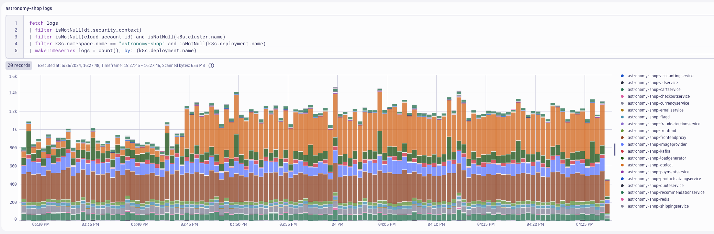

## OpenTelemetry Logs
In this lab we'll utilize the OpenTelemetry Collector deployed as a DaemonSet (Node Agent) to collect pod/container logs from a Kubernetes cluster and ship them to Dynatrace.  Additionally, we'll deploy the OpenTelemetry Collector as a Deployment (Gateway) to watch Kubernetes Events from the Cluster and ship them to Dynatrace.

Lab tasks:
1. Deploy OpenTelemetry Collector as a DaemonSet
2. Deploy OpenTelemetry Collector as a Deployment
3. Configure OpenTelemetry Collector service pipeline for log enrichment
4. Query and visualize logs in Dynatrace using DQL

