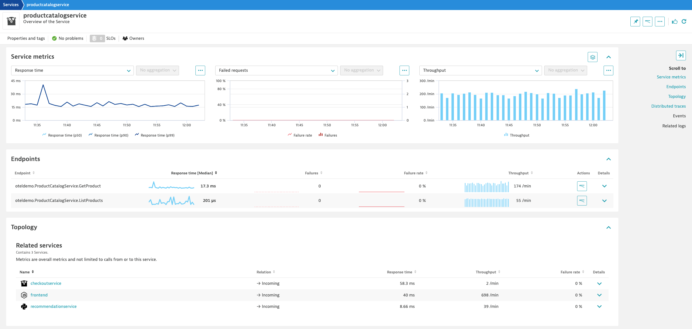
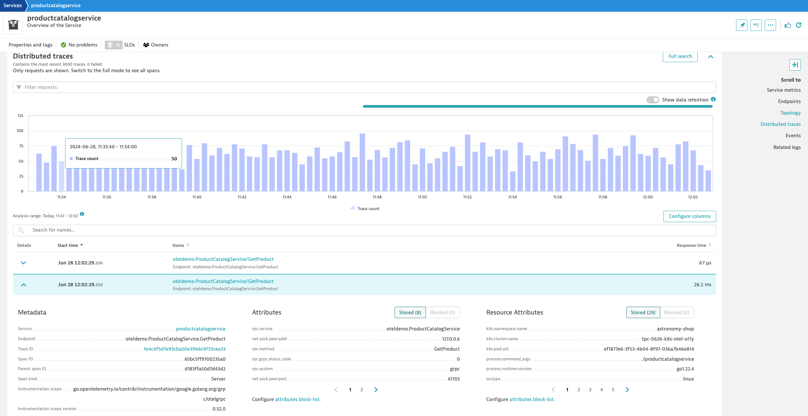

## OpenTelemetry Traces

### What You’ll Learn Today
In this lab we'll utilize the OpenTelemetry Collector deployed as a Deployment (Gateway) to collect application traces/spans, generated by OpenTelemetry, from a Kubernetes cluster and ship them to Dynatrace.

Lab tasks:
1. Deploy OpenTelemetry Collector as a Deployment
2. Configure OpenTelemetry Collector service pipeline for span enrichment
3. Analyze application reliability via traces in Dynatrace

