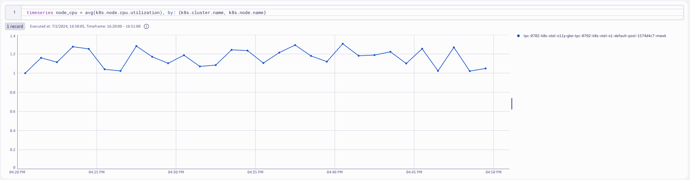
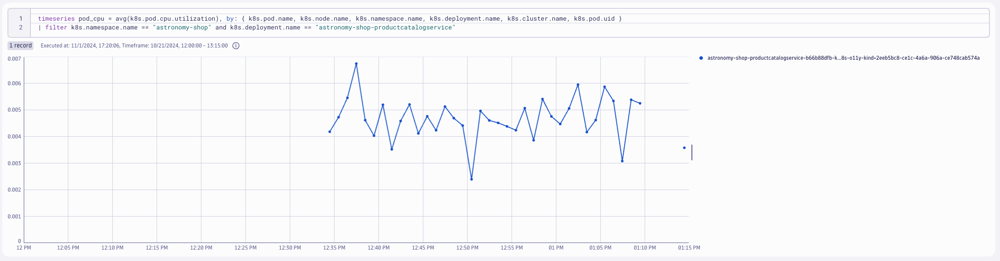

## Collector for Node Metrics

### Kubernetes Node Metrics

Each Kubernetes Node runs a kubelet that includes an API server. The `kubeletstats` Receiver connects to that kubelet via the API server to collect metrics about the node and the workloads running on the node.

### Deploy OpenTelemetry Collector 

### Contrib Distro - Daemonset (Node Agent)

The `kubeletstats` receiver is only available on the Contrib Distro of the OpenTelemetry Collector.  Therefore we must deploy a new Collector using the `contrib` image.

```yaml
---
apiVersion: opentelemetry.io/v1alpha1
kind: OpenTelemetryCollector
metadata:
  name: dynatrace-metrics-node
  namespace: dynatrace
spec:
  envFrom:
  - secretRef:
      name: dynatrace-otelcol-dt-api-credentials
  env:
    - name: K8S_NODE_NAME
      valueFrom:
        fieldRef:
          fieldPath: spec.nodeName
  mode: "daemonset"
  image: "otel/opentelemetry-collector-contrib:0.103.0"
```
Command:
```sh
kubectl apply -f opentelemetry/collector/metrics/otel-collector-metrics-node-crd-01.yaml
```
Sample output:
> opentelemetrycollector.opentelemetry.io/dynatrace-metrics-node created

### Validate running pod(s)
Command:
```sh
kubectl get pods -n dynatrace
```
Sample output:
| NAME                             | READY | STATUS  | RESTARTS | AGE |
|----------------------------------|-------|---------|----------|-----|
| dynatrace-metrics-node-collector-2kzlp   | 1/1   | Running | 0        | 1m  |

### Create `clusterrole` with read access to Kubernetes objects

Since the receiver uses the Kubernetes API, it needs the correct permission to work correctly. For most use cases, you should give the service account running the Collector the following permissions via a ClusterRole.

```yaml
---
apiVersion: rbac.authorization.k8s.io/v1
kind: ClusterRole
metadata:
  name: otel-collector-k8s-clusterrole-metrics
rules:
  - apiGroups: ['']
    resources: ['events', 'namespaces', 'namespaces/status', 'nodes', 'nodes/spec', 'nodes/stats', 'nodes/proxy', 'pods', 'pods/status', 'replicationcontrollers', 'replicationcontrollers/status', 'resourcequotas', 'services']
    verbs: ['get', 'list', 'watch']
  - apiGroups: ['apps']
    resources: ['daemonsets', 'deployments', 'replicasets', 'statefulsets']
    verbs: ['get', 'list', 'watch']
  - apiGroups: ['extensions']
    resources: ['daemonsets', 'deployments', 'replicasets']
    verbs: ['get', 'list', 'watch']
  - apiGroups: ['batch']
    resources: ['jobs', 'cronjobs']
    verbs: ['get', 'list', 'watch']
  - apiGroups: ['autoscaling']
    resources: ['horizontalpodautoscalers']
    verbs: ['get', 'list', 'watch']
```
Command:
```sh
kubectl apply -f opentelemetry/rbac/otel-collector-k8s-clusterrole-metrics.yaml
```
Sample output:
> clusterrole.rbac.authorization.k8s.io/otel-collector-k8s-clusterrole-metrics created

### Create `clusterrolebinding` for OpenTelemetry Collector service account
```yaml
---
apiVersion: rbac.authorization.k8s.io/v1
kind: ClusterRoleBinding
metadata:
  name: otel-collector-k8s-clusterrole-metrics-crb
subjects:
- kind: ServiceAccount
  name: dynatrace-metrics-node-collector
  namespace: dynatrace
roleRef:
  kind: ClusterRole
  name: otel-collector-k8s-clusterrole-metrics
  apiGroup: rbac.authorization.k8s.io
```
Command:
```sh
kubectl apply -f opentelemetry/rbac/otel-collector-k8s-clusterrole-metrics-crb.yaml
```
Sample output:
> clusterrolebinding.rbac.authorization.k8s.io/otel-collector-k8s-clusterrole-metrics-crb created

### `kubeletstats` receiver
https://opentelemetry.io/docs/kubernetes/collector/components/#kubeletstats-receiver

By default, metrics will be collected for pods and nodes, but you can configure the receiver to collect container and volume metrics as well. The receiver also allows configuring how often the metrics are collected:

```yaml
config: |
    receivers:
      kubeletstats:
        collection_interval: 30s
        auth_type: 'serviceAccount'
        endpoint: '${env:K8S_NODE_NAME}:10250'
        insecure_skip_verify: true
        metric_groups:
          - node
          - pod
          - container
```
Default Metrics:

https://github.com/open-telemetry/opentelemetry-collector-contrib/blob/main/receiver/kubeletstatsreceiver/documentation.md

**note:** for this lab, the Kind cluster does not have cluster metadata to collect.  These values will be spoofed for the purposes of this lab.
```yaml
resource/kind:
  attributes:
  - key: k8s.cluster.name
    value: dt-k8s-o11y-kind
    action: insert
```

### Query Node metrics in Dynatrace
DQL:
```sql
timeseries node_cpu = avg(k8s.node.cpu.utilization), by: {k8s.cluster.name, k8s.node.name}
```
Result:



### k8sattributes Processor

The Kubernetes Attributes Processor automatically discovers Kubernetes pods, extracts their metadata, and adds the extracted metadata to spans, metrics, and logs as resource attributes.

The Kubernetes Attributes Processor is one of the most important components for a collector running in Kubernetes. Any collector receiving application data should use it. Because it adds Kubernetes context to your telemetry, the Kubernetes Attributes Processor lets you correlate your application’s traces, metrics, and logs signals with your Kubernetes telemetry, such as pod metrics and traces.

### Add `k8sattributes` processor
https://opentelemetry.io/docs/kubernetes/collector/components/#kubernetes-attributes-processor

The `k8sattributes` processor will query metadata from the cluster about the k8s objects.  The Collector will then marry this metadata to the telemetry.

```yaml
k8sattributes:
  auth_type: "serviceAccount"
  passthrough: false
  filter:
    node_from_env_var: KUBE_NODE_NAME
  extract:
    metadata:
      - k8s.namespace.name
      - k8s.deployment.name
      - k8s.daemonset.name
      - k8s.job.name
      - k8s.cronjob.name
      - k8s.replicaset.name
      - k8s.statefulset.name
      - k8s.pod.name
      - k8s.pod.uid
      - k8s.node.name
      - k8s.container.name
      - container.id
      - container.image.name
      - container.image.tag
    labels:
      - tag_name: app.label.component
        key: app.kubernetes.io/component
        from: pod
    pod_association:
      - sources:
          - from: resource_attribute
            name: k8s.pod.uid
      - sources:
          - from: resource_attribute
            name: k8s.pod.name
      - sources:
          - from: resource_attribute
            name: k8s.pod.ip
      - sources:
          - from: connection
```
Command:
```sh
kubectl apply -f opentelemetry/collector/metrics/otel-collector-metrics-node-crd-02.yaml
```
Sample output:
> opentelemetrycollector.opentelemetry.io/dynatrace-metrics-node configured

### Validate running pod(s)
Command:
```sh
kubectl get pods -n dynatrace
```
Sample output:
| NAME                             | READY | STATUS  | RESTARTS | AGE |
|----------------------------------|-------|---------|----------|-----|
| dynatrace-metrics-node-collector-drk1p   | 1/1   | Running | 0        | 1m  |

### Query Pod metrics in Dynatrace
DQL:
```sql
timeseries pod_cpu = avg(k8s.pod.cpu.utilization), by: { k8s.pod.name, k8s.node.name, k8s.namespace.name, k8s.deployment.name, k8s.cluster.name, k8s.pod.uid }
| filter k8s.namespace.name == "astronomy-shop" and k8s.deployment.name == "astronomy-shop-productcatalogservice"
```
Result:


