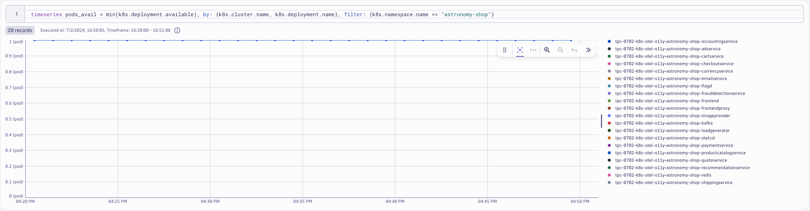
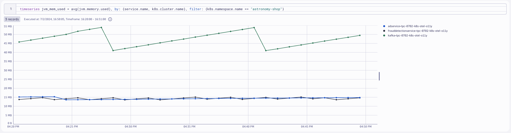
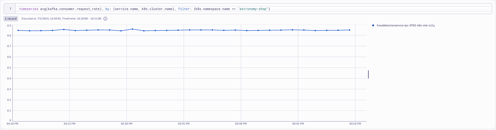
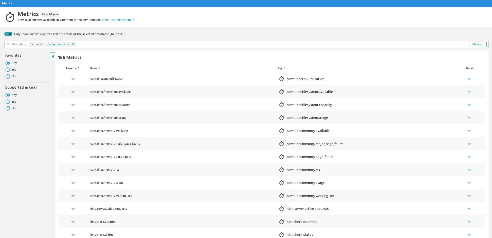

## Collector for Cluster Metrics

### Kubernetes Cluster Metrics

The Kubernetes Cluster Receiver collects metrics and entity events about the cluster as a whole using the Kubernetes API server. Use this receiver to answer questions about pod phases, node conditions, and other cluster-wide questions.

### Deploy OpenTelemetry Collector

### Contrib Distro - Deployment (Gateway)
https://github.com/open-telemetry/opentelemetry-operator

The `k8s_cluster` receiver is only available on the Contrib Distro of the OpenTelemetry Collector.  Therefore we must deploy a new Collector using the `contrib` image.

Since the receiver gathers telemetry for the cluster as a whole, only one instance of the receiver is needed across the cluster in order to collect all the data.  The Collector will be deployed as a Deployment (Gateway).

```yaml
---
apiVersion: opentelemetry.io/v1alpha1
kind: OpenTelemetryCollector
metadata:
  name: dynatrace-metrics-cluster
  namespace: dynatrace
spec:
  envFrom:
  - secretRef:
      name: dynatrace-otelcol-dt-api-credentials
  mode: "deployment"
  image: "otel/opentelemetry-collector-contrib:0.103.0"
```
Command:
```sh
kubectl apply -f opentelemetry/collector/metrics/otel-collector-metrics-cluster-crd-01.yaml
```
Sample output:
> opentelemetrycollector.opentelemetry.io/dynatrace-metrics-cluster created

### Validate running pod(s)
Command:
```sh
kubectl get pods -n dynatrace
```
Sample output:
| NAME                             | READY | STATUS  | RESTARTS | AGE |
|----------------------------------|-------|---------|----------|-----|
| dynatrace-metrics-cluster-collector-7bd8dc4995-6sgs2   | 1/1   | Running | 0        | 1m  |

### `k8s_cluster` receiver
https://opentelemetry.io/docs/kubernetes/collector/components/#kubernetes-cluster-receiver
```yaml
config: |
    receivers:
      k8s_cluster:
        collection_interval: 60s
        node_conditions_to_report: [ "Ready", "MemoryPressure", "DiskPressure" ]
        allocatable_types_to_report: [ "cpu","memory" ]
        metadata_collection_interval: 5m
```
Default Metrics:

https://github.com/open-telemetry/opentelemetry-collector-contrib/blob/main/receiver/k8sclusterreceiver/documentation.md

### Query Deployment metrics in Dynatrace
DQL:
```sql
timeseries pods_avail = min(k8s.deployment.available), by: {k8s.cluster.name, k8s.deployment.name}, filter: {k8s.namespace.name == "astronomy-shop"}
```
Result:



### Export to OTLP Receiver

The `astronomy-shop` demo application has the OpenTelemetry agents and SDKs already instrumented.  These agents and SDKs are generating metrics (traces and logs too) that are being exported to a Collector running within the `astronomy-shop` namespace bundled into the application deployment.  We want these metrics to be shipped to Dynatrace as well.

### `otlp` receiver
https://github.com/open-telemetry/opentelemetry-collector/tree/main/receiver/otlpreceiver

Adding the `otlp` receiver allows us to receive telemetry from otel exporters, such as agents and other collectors.

```yaml
config: |
    receivers:
      otlp:
        protocols:
          grpc:
            endpoint: 0.0.0.0:4317
          http:
            endpoint: 0.0.0.0:4318
    service:
      pipelines:
        metrics:
          receivers: [otlp]
          processors: [batch]
          exporters: [otlphttp/dynatrace]
```

### Export OpenTelemetry data from `astronomy-shop` to OpenTelemetry Collector - Contrib Distro

### Customize astronomy-shop helm values

OpenTelemetry data created by agents and SDKs should include `service.name` and `service.namespace` attributes.  We will make the `service.namespace` unique to our deployment using our `NAME` environment variable declared earlier, using a `sed` command on the Helm chart's `values.yaml` file.

```yaml
default:
  # List of environment variables applied to all components
  env:
    - name: OTEL_SERVICE_NAME
      valueFrom:
        fieldRef:
          apiVersion: v1
          fieldPath: "metadata.labels['app.kubernetes.io/component']"
    - name: OTEL_COLLECTOR_NAME
      value: '{{ include "otel-demo.name" . }}-otelcol'
    - name: OTEL_EXPORTER_OTLP_METRICS_TEMPORALITY_PREFERENCE
      value: cumulative
    - name: OTEL_RESOURCE_ATTRIBUTES
      value: 'service.name=$(OTEL_SERVICE_NAME),service.namespace=NAME_TO_REPLACE,service.version={{ .Chart.AppVersion }}'
```
> service.namespace=NAME_TO_REPLACE\
> service.namespace=INITIALS-k8s-otel-o11y

Command:
```sh
sed -i "s,NAME_TO_REPLACE,$NAME," astronomy-shop/collector-values.yaml
```

### Update `astronomy-shop` OpenTelemetry Collector export endpoint via helm

Our `collector-values.yaml` contains new configurations for the application so that the `astronomy-shop` Collector includes exporters that ship to the Collectors deployed in the `dynatrace` namespace.

```yaml
exporters:
  # Dynatrace OTel Collectors
  otlphttp/dttraces:
    endpoint: http://dynatrace-traces-collector.dynatrace.svc.cluster.local:4318
  otlphttp/dtlogs:
    endpoint: http://dynatrace-logs-collector.dynatrace.svc.cluster.local:4318
  otlphttp/dtmetrics:
    endpoint: http://dynatrace-metrics-cluster-collector.dynatrace.svc.cluster.local:4318
```

Command:
```sh
helm upgrade astronomy-shop open-telemetry/opentelemetry-demo --values astronomy-shop/collector-values.yaml --namespace astronomy-shop --version "0.31.0"
```
Sample output:
> NAME: astronomy-shop\
> LAST DEPLOYED: Thu Jun 27 20:58:38 2024\
> NAMESPACE: astronomy-shop\
> STATUS: deployed\
> REVISION: 2

### Query `astronomy-shop` metrics in Dynatrace
DQL:
```sql
timeseries jvm_mem_used = avg(jvm.memory.used), by: {service.name, k8s.cluster.name}, filter: {k8s.namespace.name == "astronomy-shop"}
```
Result:



DQL:
```sql
timeseries avg(kafka.consumer.request_rate), by: {service.name, k8s.cluster.name}, filter: {k8s.namespace.name == "astronomy-shop"}
```
Result:



### Browse available metrics in Dynatrace
You can browse all available metrics from OpenTelemetry sources in the Metrics Browser.  Filter on `Dimension:otel.scope.name` to find relevant metrics.

https://docs.dynatrace.com/docs/observe-and-explore/dashboards-classic/metrics-browser

