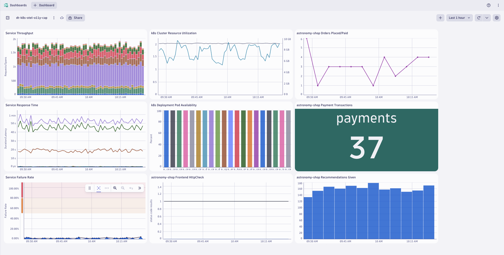
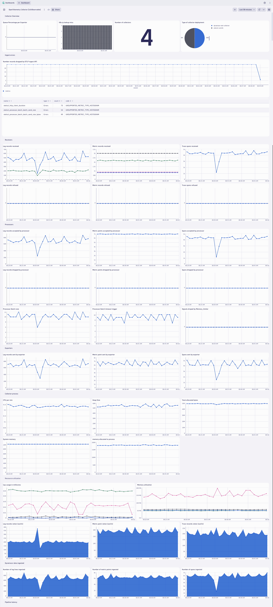

## Prerequisites

### Import Dashboards into Dynatrace


[astronomy-shop dashboard](https://github.com/popecruzdt/dt-k8s-otel-o11y-cap/blob/code-spaces/dt-k8s-otel-o11y-cap_dt_dashboard.json)


[collector health dashboard](https://github.com/popecruzdt/dt-k8s-otel-o11y-cap/blob/code-spaces/OpenTelemetry_Collector_%5BIsItObservable%5D_dt_dashboard.json)

### Define workshop user variables
In your Github Codespaces Terminal:
```
DT_ENDPOINT=https://{your-environment-id}.live.dynatrace.com/api/v2/otlp
DT_API_TOKEN={your-api-token}
NAME=<INITIALS>-k8s-otel-o11y
```

### Move into home directory
Command:
```sh
cd ~
```

### Clone the `code-spaces` branch to your Codespaces instance
Command:
```sh
git clone --single-branch --branch code-spaces https://github.com/popecruzdt/dt-k8s-otel-o11y-cap.git
```

### Move into the base directory
Command:
```sh
cd dt-k8s-otel-o11y-cap
```

### Clean Up Previous Deployments
Delete `dynatrace` namespace and all previous deployments

Command:
```sh
kubectl delete ns dynatrace
```

### Deploy OpenTelemetry Operator

### Create `dynatrace` namespace
Command:
```sh
kubectl create namespace dynatrace
```
Sample output:
> namespace/dynatrace created

### Create `dynatrace-otelcol-dt-api-credentials` secret

The secret holds the API endpoint and API token that OpenTelemetry data will be sent to.

Command:
```sh
kubectl create secret generic dynatrace-otelcol-dt-api-credentials --from-literal=DT_ENDPOINT=$DT_ENDPOINT --from-literal=DT_API_TOKEN=$DT_API_TOKEN -n dynatrace
```
Sample output:
> secret/dynatrace-otelcol-dt-api-credentials created

### Deploy `cert-manager`, pre-requisite for `opentelemetry-operator`
https://cert-manager.io/docs/installation/

Command:
```sh
kubectl apply -f opentelemetry/cert-manager.yaml
```
Sample output:
> namespace/cert-manager created\
> customresourcedefinition.apiextensions.k8s.io/certificaterequests.cert-manager.io created\
> customresourcedefinition.apiextensions.k8s.io/certificates.cert-manager.io created\
> ...\
> validatingwebhookconfiguration.admissionregistration.k8s.io/cert-manager-webhook created

Wait 30-60 seconds for cert-manager to finish initializing before continuing.

### Deploy `opentelemetry-operator`

The OpenTelemetry Operator will deploy and manage the custom resource `OpenTelemetryCollector` deployed on the cluster.

Command:
```sh
kubectl apply -f opentelemetry/opentelemetry-operator.yaml
```
Sample output:
> namespace/opentelemetry-operator-system created\
> customresourcedefinition.apiextensions.k8s.io/instrumentations.opentelemetry.io created\
> customresourcedefinition.apiextensions.k8s.io/opampbridges.opentelemetry.io created\
> ...\
> validatingwebhookconfiguration.admissionregistration.k8s.io/opentelemetry-operator-validating-webhook-configuration configured

Wait 30-60 seconds for opentelemetry-operator-controller-manager to finish initializing before continuing.

Validate that the OpenTelemetry Operator components are running.

Command:
```sh
kubectl get pods -n opentelemetry-operator-system
```
Sample output:
| NAME                             | READY | STATUS  | RESTARTS | AGE |
|----------------------------------|-------|---------|----------|-----|
| opentelemetry-operator-controller-manager-5d746dbd64-rf9st   | 2/2   | Running | 0        | 1m  |

### Create `clusterrole` with read access to Kubernetes objects
```yaml
---
apiVersion: rbac.authorization.k8s.io/v1
kind: ClusterRole
metadata:
  name: otel-collector-k8s-clusterrole
rules:
  - apiGroups: ['']
    resources: ['events', 'namespaces', 'namespaces/status', 'nodes', 'nodes/spec', 'nodes/stats', 'nodes/proxy', 'pods', 'pods/status', 'replicationcontrollers', 'replicationcontrollers/status', 'resourcequotas', 'services']
    verbs: ['get', 'list', 'watch']
  - apiGroups: ['apps']
    resources: ['daemonsets', 'deployments', 'replicasets', 'statefulsets']
    verbs: ['get', 'list', 'watch']
  - apiGroups: ['extensions']
    resources: ['daemonsets', 'deployments', 'replicasets']
    verbs: ['get', 'list', 'watch']
  - apiGroups: ['batch']
    resources: ['jobs', 'cronjobs']
    verbs: ['get', 'list', 'watch']
  - apiGroups: ['autoscaling']
    resources: ['horizontalpodautoscalers']
    verbs: ['get', 'list', 'watch']
```
Command:
```sh
kubectl apply -f opentelemetry/rbac/otel-collector-k8s-clusterrole.yaml
```
Sample output:
> clusterrole.rbac.authorization.k8s.io/otel-collector-k8s-clusterrole created

### Create `clusterrolebinding` for OpenTelemetry Collector service accounts
```yaml
---
apiVersion: rbac.authorization.k8s.io/v1
kind: ClusterRoleBinding
metadata:
  name: otel-collector-k8s-clusterrole-crb
subjects:
- kind: ServiceAccount
  name: dynatrace-deployment-collector
  namespace: dynatrace
- kind: ServiceAccount
  name: dynatrace-daemonset-collector
  namespace: dynatrace
- kind: ServiceAccount
  name: contrib-deployment-collector
  namespace: dynatrace
- kind: ServiceAccount
  name: contrib-daemonset-collector
  namespace: dynatrace
roleRef:
  kind: ClusterRole
  name: otel-collector-k8s-clusterrole
  apiGroup: rbac.authorization.k8s.io
```
Command:
```sh
kubectl apply -f opentelemetry/rbac/otel-collector-k8s-clusterrole-crb.yaml
```
Sample output:
> clusterrolebinding.rbac.authorization.k8s.io/otel-collector-k8s-clusterrole-crb created