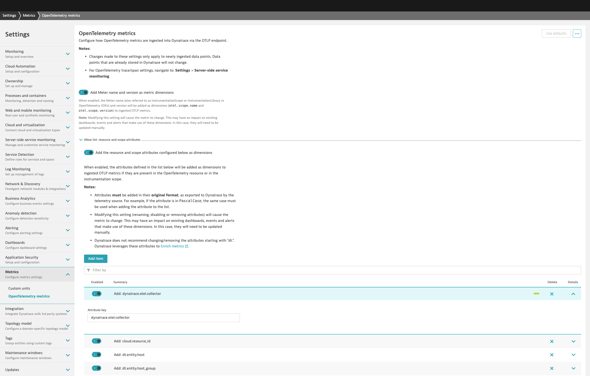
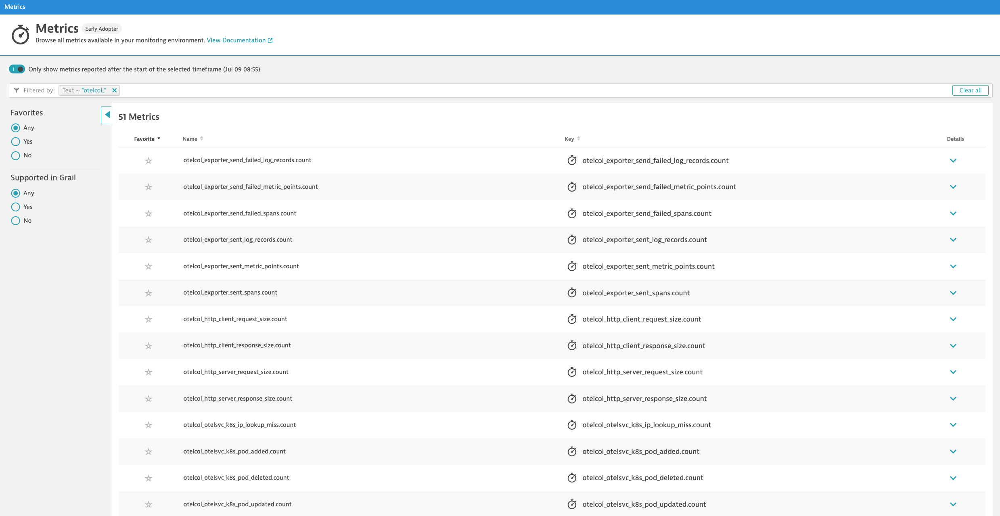
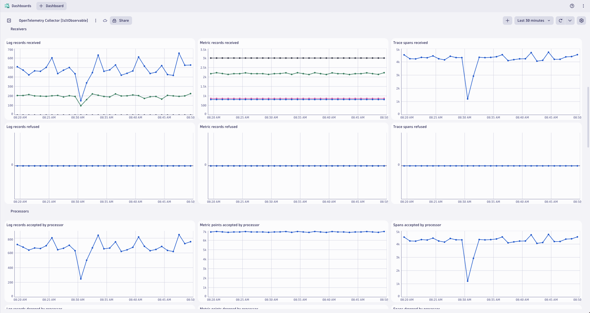

## OpenTelemetry Collector Health

### Observe OpenTelemetry Collector health in Dynatrace
https://opentelemetry.io/docs/collector/internal-telemetry/

* Add `dynatrace.otel.collector` to Dynatrace's metric attribute allow list
* Enable OpenTelemetry Collector health metrics (Prometheus)
* Modify OpenTelemetry Collector health metrics for Dynatrace support
* View OpenTelemetry Collector health metrics in Dynatrace

### Add `dynatrace.otel.collector` to Dynatrace's metric attribute allow list
By default, the metric attribute `dynatrace.otel.collector` is dropped by Dynatrace.  Add it to the allow list in your Dynatrace tenant:

https://docs.dynatrace.com/docs/extend-dynatrace/opentelemetry/getting-started/metrics/configuration


### Enable OpenTelemetry Collector health metrics (Prometheus)
Enable metric generation for Collector CRD:
```yaml
---
apiVersion: opentelemetry.io/v1alpha1
kind: OpenTelemetryCollector
metadata:
  namespace: dynatrace
spec:
  observability:
    metrics:
      enableMetrics: true
```

Enable publishing of metric generation to Prometheus endpoint:
```yaml
---
apiVersion: opentelemetry.io/v1alpha1
kind: OpenTelemetryCollector
metadata:
  namespace: dynatrace
spec:
  env:
    - name: MY_POD_IP
      valueFrom:
        fieldRef:
          apiVersion: v1
          fieldPath: status.podIP
  config: |
    receivers:

    processors:

    exporters:

    service:
      telemetry:
        metrics:
          level: "normal"
          address: ${MY_POD_IP}:8888
```

Enable scraping of metrics from Prometheus endpoint:
```yaml
---
apiVersion: opentelemetry.io/v1alpha1
kind: OpenTelemetryCollector
metadata:
  namespace: dynatrace
spec:
  config: |
    receivers:
      prometheus:
        config:
          scrape_configs:
          - job_name: opentelemetry-collector
            scrape_interval: 30s
            static_configs:
            - targets:
              - ${MY_POD_IP}:8888

    processors:
      batch:

    exporters:
      otlphttp/dynatrace:

    service:
      pipelines:
        metrics:
          receivers: [prometheus]
          processors: [batch]
          exporters: [otlphttp/dynatrace]
```

### Modify OpenTelemetry Collector health metrics for Dynatrace support
Specific metric types are supported by Dynatrace:

https://docs.dynatrace.com/docs/platform-modules/infrastructure-monitoring/container-platform-monitoring/kubernetes-monitoring/monitor-prometheus-metrics#usage

Convert unsupported cumulative sum metric types to delta type for Dynatrace support:
```yaml
processors:
  cumulativetodelta: {}
service:
  pipelines:
  metrics:
    receivers: [prometheus]
    processors: [cumulativetodelta,batch]
    exporters: [otlphttp/dynatrace]
```

Filter out (remove) unsupported histogram metric types for Dynatrace support:
```yaml
processors:
  filter/histogram:
    error_mode: ignore
    metrics:
      metric:
      - 'type == METRIC_DATA_TYPE_HISTOGRAM'

service:
  pipelines:
  metrics:
    receivers: [prometheus]
    processors: [filter/histogram,batch]
    exporters: [otlphttp/dynatrace]
```

### View OpenTelemetry Collector health metrics in Dynatrace
Prometheus metrics from the OpenTelemetry Collector have the `otelcol_` prefix and can be found in the Dynatrace metric browser:


Example dashboard for OpenTelemetry Collector health has been created by the `IsItObservable` team:


[YouTube Video](https://youtu.be/Qxt3XAMJNhA?si=LY_37zRJC8hCTpjX&t=2630)